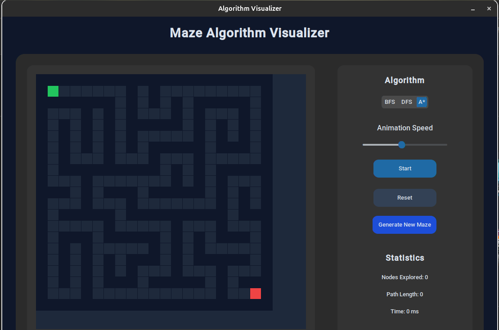

# AlgoVisualizer

AlgoVisual is an algorithm visualization project designed to demonstrate how common sorting and searching algorithms work internally. The goal of this project is to implement these algorithms from scratch and provide a clear, step-by-step visual representation of their execution.





## Overview

This project focuses on writing clean, structured implementations of fundamental algorithms and visualizing their behavior in real time. Each algorithm is implemented with clarity in mind, keeping the logic readable and easy to follow.

The visualization highlights:

- Element comparisons  
- Swapping operations  
- Recursive calls (where applicable)  
- Final sorted or searched results  

---

## Implemented Algorithms

### Sorting Algorithms

- **Bubble Sort**  
  Iteratively compares adjacent elements and swaps them if they are in the wrong order.

- **Selection Sort**  
  Repeatedly selects the minimum element from the unsorted portion and places it at the beginning.

- **Insertion Sort**  
  Builds the sorted array one element at a time by inserting elements into their correct position.

- **Merge Sort**  
  A divide-and-conquer algorithm that recursively splits the array and merges sorted halves.

- **Quick Sort**  
  Uses a pivot element to partition the array and recursively sort subarrays.

---

### Searching Algorithms

- **Linear Search**  
  Sequentially checks each element until the target is found.

- **Binary Search**  
  Efficiently searches a sorted array by repeatedly dividing the search interval in half.

---

## Code Structure

- Each algorithm is written as a separate function for modularity.
- Logic is implemented without relying on built-in sorting methods.
- The visualization layer is separated from the algorithm logic to maintain clean code structure.
- Functions are designed to clearly show comparisons, swaps, and recursion steps.

---

## Running the Project

Clone the repository:

```bash
git clone https://github.com/YOUR_USERNAME/AlgoVisual.git
cd AlgoVisual